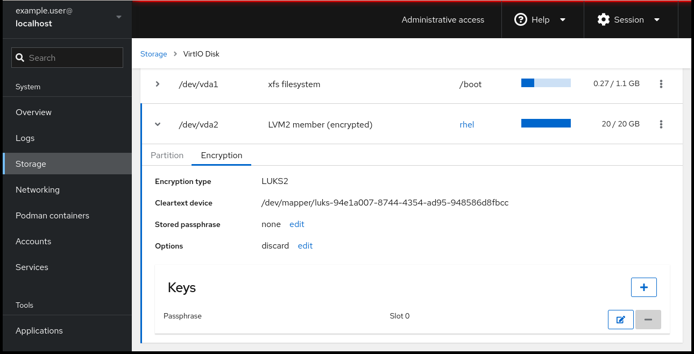

## Server

install tang server

```shell
sudo dnf install tang
```

sebelum melakukan installasi pastikan:

- package `policycoreutils-python-utils`dan package yang terhubung dengannya telah terinstall.

- pastikan service `firewalld` berjalan dengan baik

kita akan menjalankan tang server pada port `7500` untuk itu kita harus membuat selinux policy untuk memberikan izin bagi tang server untuk bisa beroperasi pada port `7500`

```shell
semanage port -a -t tangd_port_t -p tcp 7500
```

selanjutnya kita pastikan untuk membuka port `7500` pada firewall dengan perintah

```shell
firewall-cmd --zone=public --permanent --add-port=7500/tcp
```

reload firewall untuk aktivasi konfigurasi dengan perintah

```shell
firewall-cmd --reload
```

selanjutnya enable service `tangd` dengan perintah

```shell
systemctl enable tangd.socket
```

setelah socket active kita ubah bind default dari tang yang awalnya berjalan pada port `80` menjadi port `7500` dengan perintah

```shell
systemctl edit tangd.socket
```

selanjutnya isikan konfigurasi berikut

```shell
[Socket]
ListenStream=
ListenStream=7500
```

save konfigurasi dan lakukan reload-daemon dengan perintah

```shell
systemctl daemon-reload
```

lakukan pengecekan service `tang` dengan perintah

```shell
systemctl show tangd.socket -p Listen
```

pastikan output dari perintah tersebut adalah sebagai berikut

```shell
Listen=[::]:7500 (Stream)
```

selanjutnya restart service dengan perintah

```shell
systemctl restart tangd.socket
```

## Client

install package `clevis` dan `clevis-luks` dengan perintah

```shell
dnf install clevis clevis-luks
```

Selanjutnya :

- buka cockpit pada komputer client

- pilih menu storage

- pada section FileSystem click disk yang terenksripsi dengan luks

- klik tanda `[>]` pada disk tersebut dan pilih menu encryption.

- klik tanda `[+]` dan tambahkan key
  
  

- pilih Tang Server sebagai kunci, dan masukan ip dari tang server beserta password yang digunakan untuk membuka enkripsi luks pada komputer cline


- Pada terminal di tang server gunakan perintah `tang-show-keys` untuk membandingkan hash antara komputer client dan tang server
  
  ```shell
  tang-show-keys 7500
  fM-EwYeiTxS66X3s1UAywsGKGnxnpll8ig0KOQmr9CM
  ```

- Selanjutnya klik trust key dan pastikan kedua nilai hash sama

 

- verifikasi clevis telah berjalan pada awal mula proses boot dengan perintah
  
  ```shell
   lsinitrd | grep clevis
  ```
  
  idealnya ouput dari command tersebut adalah
  
  ```shell
  clevis
  clevis-pin-null
  clevis-pin-sss
  clevis-pin-tang
  clevis-pin-tpm2
  ```


#### Reference

[Configuring automated unlocking of encrypted volumes using policy-based decryption Red Hat Enterprise Linux 8](https://access.redhat.com/documentation/id-id/red_hat_enterprise_linux/8/html/security_hardening/configuring-automated-unlocking-of-encrypted-volumes-using-policy-based-decryption_security-hardening#rotating-tang-keys_configuring-automated-unlocking-of-encrypted-volumes-using-policy-based-decryption)


